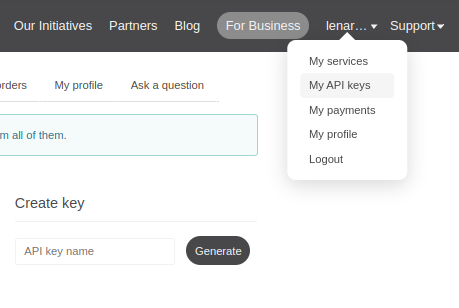

# Weather API SDK
The Weather API SDK is a Java library that provides easy access to weather data from the OpenWeatherMap API. It supports two modes of operation: on-demand and polling. The SDK is designed to be thread-safe, configurable, and easy to integrate into Java applications.
It works with passed API KEY (should be acquired on https://openweathermap.org) and location name (London, Moscow, Paris).
Works with version 2.5 of openweather API - https://api.openweathermap.org/data/2.5/weather?q={cityname}&appid={APIkey}. 

For details, please visit: https://openweathermap.org/current 

Free api key could be generated on Weather API after signing in:

https://home.openweathermap.org/api_keys



## Features
On-Demand Mode: Fetches weather data only when explicitly requested.

Polling Mode: Periodically updates weather data for all cached locations.

Caching: In-memory cache to store weather data and reduce API calls.

Configurable Settings: Customize cache size, data freshness period, and polling intervals.

Thread-Safe: Designed for use in multi-threaded environments.

Exception Handling: Provides meaningful exceptions for invalid configurations, API errors, and service shutdowns.

## Installation
### Maven
Add the following dependency to your pom.xml:

```xml
<dependency>
   <groupId>com.lenarsharipov.weather-api</groupId>
   <artifactId>weather-api</artifactId>
   <version>1.0.2</version>
</dependency>
```
### Usage
1. Create a Weather Service
   Use the WeatherServiceFactory to create a weather service instance. You can choose between on-demand and polling modes.

```java
import com.lenarsharipov.weather_api.WeatherServiceFactory;
import com.lenarsharipov.weather_api.mode.ApiMode;
import com.lenarsharipov.weather_api.service.WeatherService;

public class Main {
    public static void main(String[] args) {
        String apiKey = "your-api-key";
        ApiMode apiMode = ApiMode.ON_DEMAND; // or ApiMode.POLLING

        // Create a weather service with default settings
        WeatherService weatherService = WeatherServiceFactory.getWeatherService(apiKey, apiMode);

        // Use the service to fetch weather data
        try {
            String location = "London";
            WeatherResponse response = weatherService.getWeather(location);
            System.out.println("Weather in " + location + ": " + response);
        } catch (Exception e) {
            System.err.println("Failed to fetch weather data: " + e.getMessage());
        } finally {
            // Shutdown the service when done
            WeatherServiceFactory.removeWeatherService(apiKey);
        }
    }
}
```

2. Customize Settings
   You can customize the settings for the weather service, such as cache size, data freshness period, and polling intervals.
```java
import com.lenarsharipov.weather_api.WeatherServiceFactory;
import com.lenarsharipov.weather_api.mode.ApiMode;
import com.lenarsharipov.weather_api.settings.Settings;

public class Main {
    public static void main(String[] args) {
        String apiKey = "your-api-key";
        ApiMode apiMode = ApiMode.POLLING;

        // Custom settings
        Settings settings = Settings.builder()
                .dataFreshnessPeriod(15) // Data is considered fresh for 15 minutes
                .cache(new Settings.Cache(100)) // Cache size of 100 entries
                .polling(new Settings.Polling(10, 30, TimeUnit.MINUTES)) // Poll every 30 minutes
                .build();

        // Create a weather service with custom settings
        WeatherService weatherService = WeatherServiceFactory.getWeatherService(apiKey, apiMode, settings);

        // Use the service...
    }
}
```

3. Handle Exceptions
   The SDK throws specific exceptions for invalid configurations, API errors, and service shutdowns. Handle them appropriately in your application.
```java
import com.lenarsharipov.weather_api.exception.*;

try {
    WeatherResponse response = weatherService.getWeather("London");
} catch (HttpException e) {
    System.err.println("API error: " + e.getMessage());
} catch (ServiceShutDownException e) {
    System.err.println("Service is shut down: " + e.getMessage());
} catch (IllegalWeatherServiceFactoryArgsException e) {
    System.err.println("Invalid arguments: " + e.getMessage());
}
```

## API Overview
### WeatherServiceFactory
#### getWeatherService(String apiKey, ApiMode apiMode): 
Creates a weather service with default settings.

#### getWeatherService(String apiKey, ApiMode apiMode, Settings settings): 
Creates a weather service with custom settings.

#### removeWeatherService(String apiKey): 
Removes and shuts down the weather service for the given API key.

### WeatherService
#### getWeather(String location): 
Fetches weather data for the specified location.

#### shutdown(): 
Shuts down the service and clears the cache.

### Settings
#### dataFreshnessPeriod: 
The time (in minutes) after which data is considered stale.

#### cache: 
Configuration for the in-memory cache (size).

#### polling: 
Configuration for polling mode (initial delay, period, and time unit).

## Examples
### On-Demand Mode
```java
WeatherService weatherService = WeatherServiceFactory.getWeatherService(apiKey, ApiMode.ON_DEMAND);
WeatherResponse response = weatherService.getWeather("Paris");
System.out.println("Weather in Paris: " + response);
```

### Polling Mode
```java
Settings settings = Settings.builder()
        .dataFreshnessPeriod(10)
        .cache(new Settings.Cache(50))
        .polling(new Settings.Polling(0, 5, TimeUnit.MINUTES))
        .build();

WeatherService weatherService = WeatherServiceFactory.getWeatherService(apiKey, ApiMode.POLLING, settings);
WeatherResponse response = weatherService.getWeather("Berlin");
System.out.println("Weather in Berlin: " + response);
```

## Deployment Script
The SDK includes a deployment script (publish.sh) to automate the process of publishing new versions to GitHub Packages.

### Usage
1. Make the script executable:
```bash
chmod +x publish.sh
```
2. Run the script with the desired version:
```bash
./publish.sh 1.0.1
```

### What the Script Does
1. Updates the version in pom.xml to the specified version.
2. Builds the project and publishes it to GitHub Packages.
3. Removes the backup file (pom.xml.versionsBackup) if the deployment is successful.
4. Restores the original pom.xml if the deployment fails.

## Error Handling
### The SDK throws the following exceptions:

#### IllegalWeatherServiceFactoryArgsException: 
Invalid arguments (e.g., null API key or mode).

#### ServiceExistsException: 
A service already exists for the given API key.

#### ServiceNotFoundException: 
No service exists for the given API key.

#### HttpException: 
An error occurred while making an API request.

#### ServiceShutDownException: 
The service is shut down and cannot be used.

## Support
For questions or issues, please contact:

Author: Lenar Sharipov

Email: lenarsharipov@gmail.com
